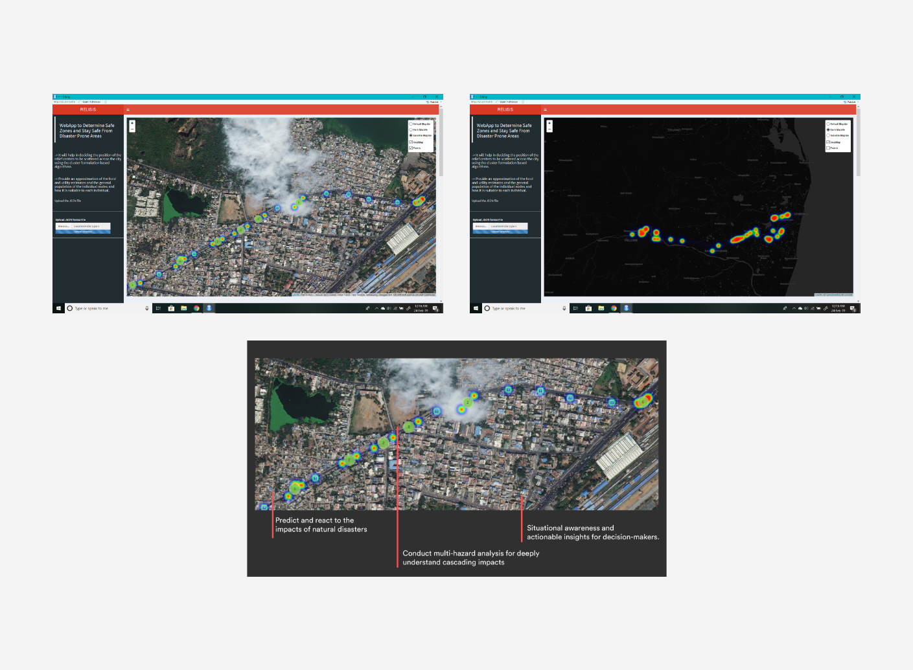
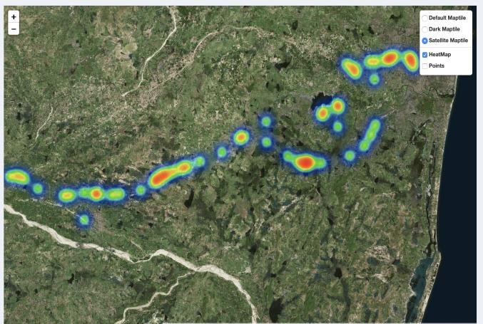
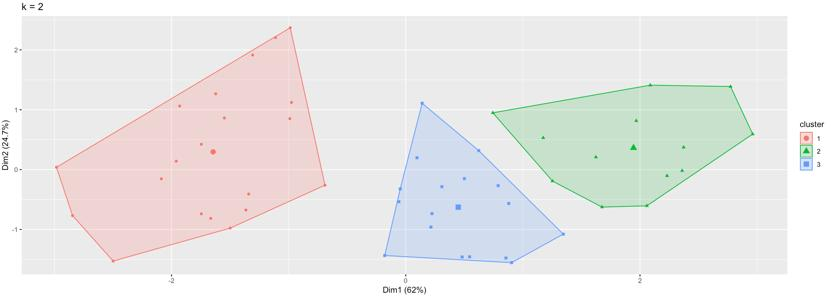

# Relisis- Relief Centre Detection

Developed an iOS application for people, where in case of an individual is stuck in an unforeseen calamity can push a SOS Button for emergency.The application also navigates the person to the nearest live ‘Relief Centre’. It provides the user to mark themselves safe, which on incorporation feeds the real time firebase database, where a certain amount safe user can trigger the updating of ‘Safe Zone’ in disaster situations. By using classification, this application adapts and predicts the nearest safe zones.

This is the classification and detection module of teh application 'Relisis'.

## Challenge:

> Each year flood, landslide, fire, epidemics, avalanche, and various other natural and human-made disasters cause the casualty of thousands of human lives and destruction of physical property worth millions of dollars. 
> 
> By 2030, 60% of the world’s population will live in cities with 1.4 billion facing the highest risk of exposure to a natural disaster. 

Making use of the demographic data of users to build up an application that assists people in times of disasters.

## Methodology:

Worked on the implementation of R based clustering and community detection for identifying relief centres. It uses JSON data for the parsing of collected information such as - longitude, latitude, timestamp, safe (or unsafe).

It accurately produces relief centres on Google Maps API. It provides the user to mark themselves safe, which on incorporation feeds the real time firebase database, where a certain amount safe user can trigger the updating of ‘Safe Zone’ in disaster situations.

## Result:

